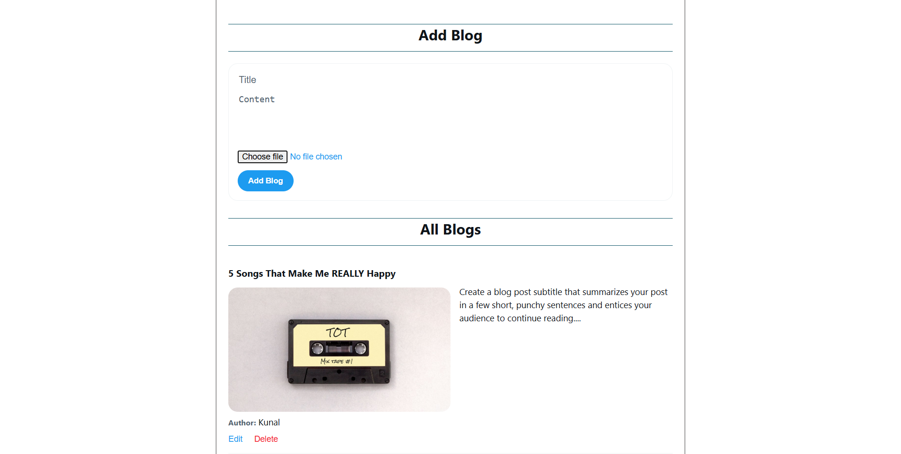

# 📝 Blog Website (MERN Stack)

A full-stack **Blog Website** built using the **MERN Stack** that allows users to **create, read, update, and delete blog posts** with **secure authentication**, **image uploads**, and **cookie-based sessions**.

---

## 🚀 Features

### 🔐 Authentication
- User **Sign Up & Sign In**
- Password encryption using **bcrypt**
- Secure **cookie-based authentication**
- HTTP-only cookies
- Protected routes for authenticated users
- Persistent login across page refresh

---

### 📰 Blog Management (CRUD)
- ✍️ Create new blog posts
- 📖 View all blogs
- 🔍 View single blog details
- ✏️ Update existing blog posts
- 🗑️ Delete blog posts (authorized users only)

---

### 🖼️ Image Upload
- Upload blog cover images
- Image handling via **Multer**
- Stored on server
- Image preview before publishing

---

### 🎨 Frontend UI
- Responsive UI built with **React**
- Separate pages for:
  - Home (Blog List & CRUD UI)
  - Sign In
  - Sign Up
- Clean component-based structure
- API integration with backend
- Cookies handled automatically during authentication

---

## 🛠️ Tech Stack

### Frontend
- React.js
- CSS
- React Router DOM

### Backend
- Node.js
- Express.js
- MongoDB
- Mongoose
- bcrypt
- Multer
- Cookie-Parser

---

## 📂 Project Structure

```bash
blog-website/
│
├── src/
│   │
│   ├── backend/                     # Backend (Node + Express)
│   │   │
│   │   ├── controllers/
│   │   │   └── blogControllers.js      # Blog CRUD logic
│   │   │
│   │   ├── models/
│   │   │   └── blogModel.js            # Blog schema
│   │   │
│   │   ├── routes/
│   │   │   └── blogRoutes.js           # Blog API routes
│   │   │
│   │   ├── middlewares/
│   │   │   └── authMiddleware.js       # Authentication & token check
│   │   │
│   │   ├── uploads/                   # Uploaded blog images
│   │   │
│   │   ├── app.js                     # Express app configuration
│   │   └── server.js                  # Server entry point
│   │
│   └── frontend/                      # Frontend (React)
│       │
│       ├── components/
│       │   │
│       │   ├── Home/
│       │   │   ├── Home.jsx            # Blog CRUD UI
│       │   │   └── Home.css
│       │   │
│       │   ├── SignIn/
│       │   │   ├── SignIn.jsx          # Sign In page
│       │   │   └── SignIn.css
│       │   │
│       │   └── SignUp/
│       │       ├── SignUp.jsx          # Sign Up page
│       │       └── SignUp.css
│       │
│       ├── App.jsx
│       ├── main.jsx
│       └── index.css
│
├── .env
├── package.json
├── .gitignore
└── README.md

```



## Demo Video 

<a href="https://drive.google.com/file/d/1Ix-CbRTHdEhdpcaLuTWk3uZOCwnLhKjl/view?usp=sharing">

</a>
