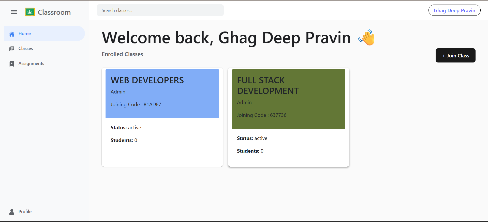

# 📚 Classroom Clone – JWT + OTP Authentication

- A full-stack Classroom Clone Application with secure authentication using JWT (JSON Web Token) and OTP verification, featuring Role-Based Access Control (RBAC) for Admin and Students.

- This project demonstrates real-world authentication flow, protected routes, and backend security best practices using the MERN stack.

## 🚀 Features

🔐 JWT Authentication

📩 OTP Verification System

👥 Role-Based Access (Admin & Student)

🛡️ Protected Routes (Middleware)

📊 Admin Dashboard

🎓 Student Dashboard

🔄 Backend Auto Restart using Nodemon

🌐 REST API Architecture

## 👤 User Roles & Permissions
### 🛠 Admin

Create & manage classrooms

Add / remove students

View all registered students

Manage classroom content

### 🎓 Student

Login with OTP verification

Access assigned classrooms

View classroom materials

## 🏗️ Tech Stack
### Frontend

- React.js

- Axios

- React Router

### Backend

- Node.js

- Express.js

- MongoDB + Mongoose

- JWT

- OTP Authentication

- Nodemon

  ## Demo Video
  
