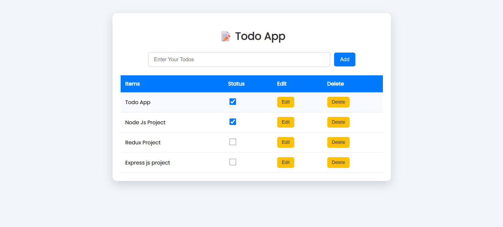

<h1>📝 Todo App — Full-Stack (React + Express + Redux Toolkit)</h1>

A fully functional Todo Management Application built using ⚛️ React, 🟩 Express.js, and 🟣 Redux Toolkit.
This project demonstrates modern full-stack development with clean folder structure, API integration, and complete CRUD functionality.

<h2>✨ Features</h2>
<h3>🎨 Frontend (React + Redux Toolkit)</h3>
➕ Add Todo

📝 Edit Todo

❌ Delete Todo

✔️ Mark as Completed

🔄 Live UI updates with Redux Toolkit

📦 Modular and clean React components

<h3>🚀 Backend (Express.js API)</h3>

📡 REST API endpoints

🌐 CORS enabled

🗂 JSON-based todo storage

 

<h2>🧩 Easy to expand with DB in future 
</h2> 
TODO_APP/  
│ 
├── server.js                   # 🚀 Express backend server 
│ 
├── src/  
│   ├── features/ 
│   │   └── todoSlice.js         # 🧠 Redux Toolkit slice (state management) 
│   │ 
│   ├── components/ 
│   │   └── Todo.jsx             # 🖥️ Todo UI component 
│   │ 
│   ├── App.jsx                  # 🧩 Main App component 
│   ├── main.jsx                 # ⚛️ React DOM entry point 
│   └── index.css                # 🎨 Global styling 
│ 
├── package.json                 # 📦 Project dependencies & scripts 
└── README.md                    # 📘 Project documentation 

<h2>🛠️ Tech Stack</h2>

<h3>Frontend</h3>

⚛️ React

🟣 Redux Toolkit

🎨 CSS / Tailwind

⚡ Vite (optional)

<h3>Backend</h3>

<h2>🟩 Node.js</h2>

🚀 Express.js

🔒 CORS

📡 REST API

<h3>🖼️ Screenshots</h3>

<h2>🔮 Future Enhancements</h2>

🔐 Add user authentication

🗄️ Connect backend to MongoDB

🎚️ Add filters (Completed / Pending)

📱 Make UI fully responsive

<h1>Demo Video</h1>

Watch Demo Video (https://drive.google.com/file/d/1PCPt5Ivf7tXnt9FUFkLAKQfFnp-IWWew/view?usp=sharing)
