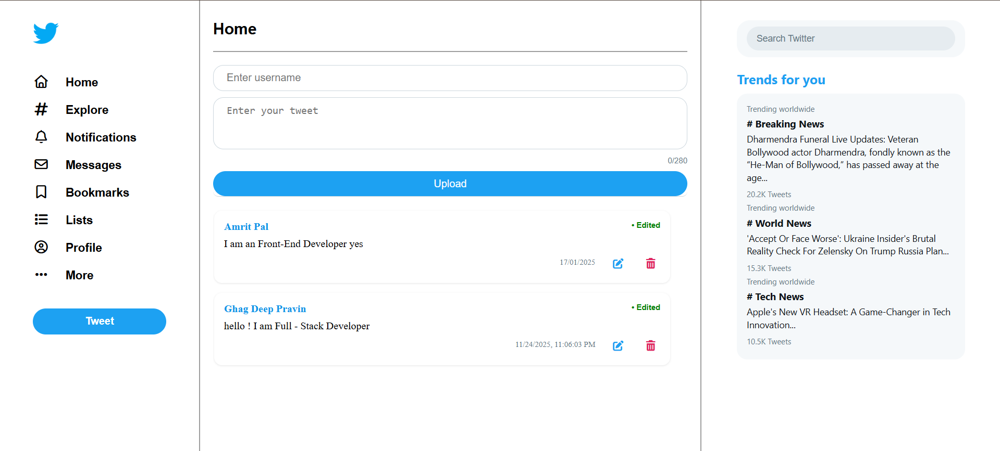

# 𝕏 Twitter Home — CRUD on Tweets

A small Twitter-like *Home* page built with **HTML, CSS, Express, Node, React & Redux Toolkit**.
This project demonstrates basic **CRUD** operations for tweets (Create, Read, Update, Delete). The UI has a single main input that accepts **both username and tweet** (by design) to keep the form minimal for demo / learning purposes.

---

## 🎯 Project Goal

Provide a compact demo of a tweet feed where users can:

* Post new tweets (username + tweet text entered together),
* View tweet list,
* Edit existing tweets,
* Delete tweets.

This is intentionally small and focused on the *home feed* experience — no auth, no profiles.

---

## 🧩 Why a single input (username + tweet)?

For this demo the UI uses one combined input field to simplify the UX and show data flow clearly between frontend and backend when you only have a single "main" page. The main reasons:

* Keeps the interface compact for a single-page demo.
* Shows how to parse a single input into two fields (username + text) on the backend or frontend.
* Useful for quick prototyping and when you want to focus on CRUD logic rather than multi-field forms.

> Example usage pattern: user types `"Amrit Pal: I love building UIs!"` or the UI provides two small inline placeholders separated visually — both are accepted and parsed before creating the tweet.

---

## 🧰 Tech Stack

* Frontend: React (functional components), Redux Toolkit
* Backend: Node.js + Express
* Static: HTML, CSS
* Data store: in-memory array (replaceable with a DB)
* Dev tools: npm / yarn, Concurrently (optional)

---

## 🔥 Features

* Create tweet (username + message)
* Read tweet list (with createdAt timestamp)
* Update / Edit tweet
* Delete tweet
* Minimal responsive UI
* Demo-ready: screenshot + demo video included (placeholders)

---

## 📁 Project Structure (example)

```
twitter-home/
├─ backend/
│  ├─ server.js
│  └─ package.json
├─ frontend/
│  ├─ src/
│  │  ├─ App.jsx
│  │  ├─ features/tweets/tweetsSlice.js
│  │  ├─ components/TweetList.jsx
│  │  └─ components/TweetForm.jsx
│  └─ package.json
├─ screenshots/
│  ├─ home.png
│  └─ create-tweet.png
└─ demo/
   └─ demo-video.mp4
```

---

## 🚀 Installation & Run (local)

> Make sure you have Node.js installed (v14+ recommended).

### Backend

```bash
cd backend
npm install
# start server
npm run dev   # or: node server.js
# defaults to http://localhost:5000
```

*example `server.js` endpoints (concept)*

* `GET /tweets` — list tweets
* `POST /tweets` — create tweet (body may contain `rawInput` or `{ username, tweet }`)
* `PUT /tweets/:id` — update tweet
* `DELETE /tweets/:id` — delete tweet

If the frontend sends a single combined input, the backend accepts `{ rawInput: "Username: message" }` and parses into `{ username, tweet }`.

### Frontend

```bash
cd frontend
npm install
npm start
# open http://localhost:3000
```

---

## 🔌 API Examples

**Create (single raw input)**

```http
POST /tweets
Content-Type: application/json

{
  "rawInput": "Amrit Pal: Hello world from my demo!"
}
```

**Create (separate fields)**

```http
POST /tweets
Content-Type: application/json

{
  "username": "Amrit Pal",
  "tweet": "Hello world from my demo!"
}
```

**Response sample**

```json
{
  "id": 12,
  "username": "Amrit Pal",
  "tweet": "Hello world from my demo!",
  "createdAt": "2025-11-24T20:00:00.000Z"
}
```

---

## 🧪 Parsing strategy (single input)

If the UI sends `rawInput`, parse it like this (either frontend or backend):

1. Try splitting by the first colon `:`:

   * Left => `username` (trimmed)
   * Right => `tweet` (trimmed)
2. Fallback:

   * If no colon found, create a default username (e.g., `"Anonymous"`) and treat the entire input as the tweet.

*Pseudocode (JS):*

```js
function parseRawInput(rawInput) {
  const idx = rawInput.indexOf(':');
  if (idx !== -1) {
    const username = rawInput.slice(0, idx).trim();
    const tweet = rawInput.slice(idx + 1).trim();
    return { username: username || 'Anonymous', tweet: tweet || '' };
  }
  return { username: 'Anonymous', tweet: rawInput.trim() };
}
```

---

## 🖼️ Screenshots

 

---

## 🎬 Demo video

Put a short demo video (30–90s) in `/demo/demo-video.mp4` and link it here:

**Demo:** [https://drive.google.com/file/d/1inj0XSFx9PgZvSePK-upi9USVOnGcqh8/view?usp=sharing]

Tips for the demo video:

* Show creating a tweet using the combined input.
* Show editing a tweet.
* Show deleting a tweet.
* Narrate (or caption) the parsing behaviour for the single input.

---

## ✅ How to test (quick)

1. Start backend and frontend.
2. Open the app in your browser.
3. In the single input, type: `YourName: This is a sample tweet`.
4. Submit — tweet appears in the list.
5. Click edit — update the tweet text.
6. Click delete — tweet removed.

---

## ♻️ Extending the project

Ideas to evolve this demo:

* Replace in-memory store with MongoDB / PostgreSQL.
* Add user authentication (JWT).
* Add profile pages and tweet threads.
* Add like/retweet functionality.
* Improve UI/UX and add animations.

---

## 📝 License

MIT License — feel free to reuse and adapt.

---

## 📬 Contact

Created by Ghag Deep Pravin — open an issue or PR if you want improvements.

---

If you want, I can:

* generate a ready `README.md` file you can copy, or
* create sample `server.js`, `tweetsSlice.js` and React components, or
* produce sample screenshots and a short demo script for recording the video.

Tell me which of those you want next and I’ll add them directly into the repo files.
